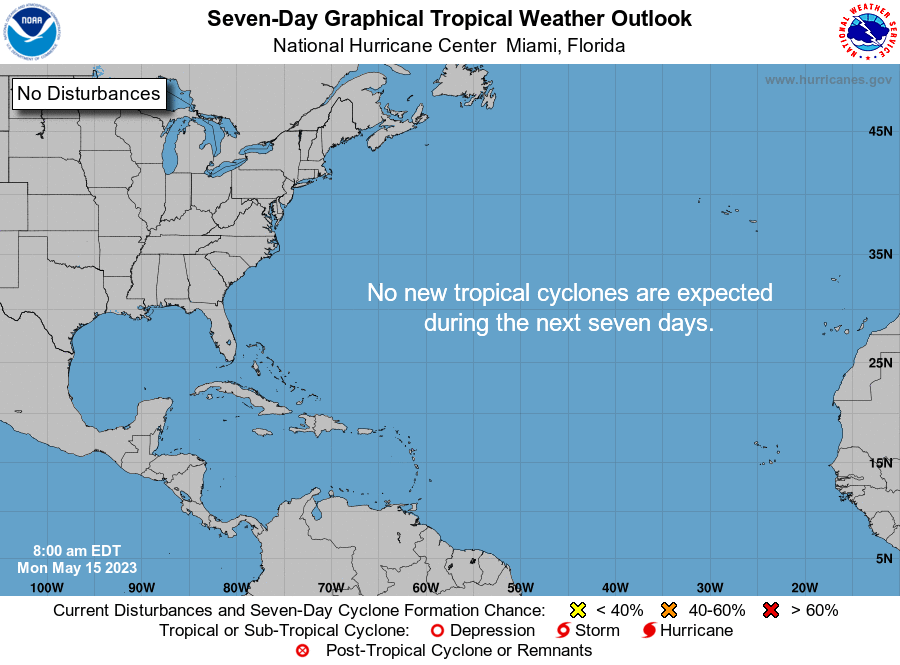

# SpaceCoast-Hurricane-Prediction

- The goal is to provide SLD 45 and Kennedy Space Center with a more precise forecast for hurricane season. Specifically, we want to know the likelihood of having a hurricane pass through our area every year.

- Tropical cyclones have an unknown number of variables to consider for forecasting. In this study I have focused on the Atlantic Multidecadal Oscillation (AMO) temperature anomalies and their effect on hurricane season for our area.

- The main goal is to provide a model prediction based on the AMO anomalies.

- Additionally, I will try to build another model that predicts likelihood of hurricanes impacting our area during the season based on sea level pressure indicies in a few locations.

- Finally, I'd like to provide a simple decision matrix for leadership when determining what actions to take when a hurricane is forecasted to impact our area.

## Hypothesis

- When Atlantic Multidecadal Oscillation (AMO) is above OR below average, we will see an increase or decrease in Hurricanes per year.

- NULL: There is no difference in hurricane likelihood with AMO anomalies.

## Model prediction for in season hurricanes

- Model prediction is for hurricanes already developed. It will give a likelihood if hurricanes will hit our area.

- Decision matrix is for leadership to determine actions to take based on historical data.

## Area of Interest

### The center point is Cape Canaveral with roughly a 60mi radius

## Hurricane Analysis

- Initially we are focusing on the Atlantic Multidecadal Oscillation (AMO) temperature anomalies and their effect on hurricane prediction for the Space Coast.

- Below is a visual of the AMO region for reference.

- Below is an image showing the AMO anomalies with the trend of hurricanes since 1850.

- Below is an image showing the AMO anomalies with the trend of hurricanes since 1950.

## Hypothesis Test

- I ran a logistic regression model to compare yearly AMO anomalies and if a hurricane passed through the area. Data is from 1856 to 2022.

- Higher positive coefficients show the temperature increase is significant and the P-Value shows this IS statistically significant. Higher temperature anomalies result in an increased likelihood of hurricanes for our area.

- Below is a chart displaying the results. Notice the significant increase as we see above normal temperature anomalies.

## Historical Average Amount of All Cyclones per Month

- The main foucs here is to show when we need to worry.
- Our area will see the most activity from August to October.
- Coupled with thunderstorm season we can expect a higher likelihood of launch scrubs due to weather.

## Historical Hurricane Tracks in Aug, Sept, and Oct

### Charts pulled from NOAA

### August

- Cyclones predominantly coming from the south to SE

### September

- Most active month

- Start to see some cyclones coming from the west now

### October

- Now we see most cyclones coming from the Gulf of Mexico

- This is due to the Atlantic water temperatures starting to cool down. The Gulf of Mexico remains warm

## Decision Recommendations for Hurricanes

- Want to create a decision matrix.
- Hurricane track from East to South. Likely Aug-Sep
  - Greatest threat, evacuation recommended.
- Hurricane track from SSW to West. Likely Oct
  - Lower threat, evacuation not recommended.

## Atlantic Basin

- This image represents the area considered the Atlantic Basin. The unfiltered data is tracking tropical cyclone development in this area.

- Image from NHC.NOAA.GOV

## Data Cleaning