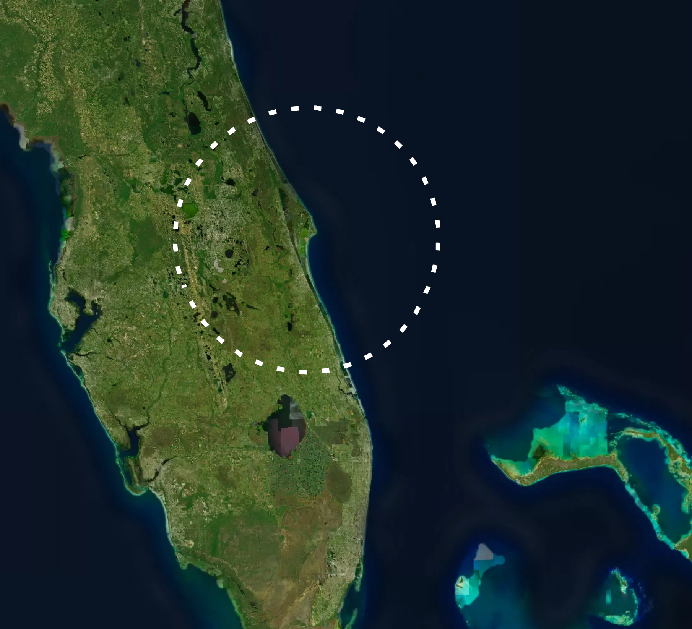
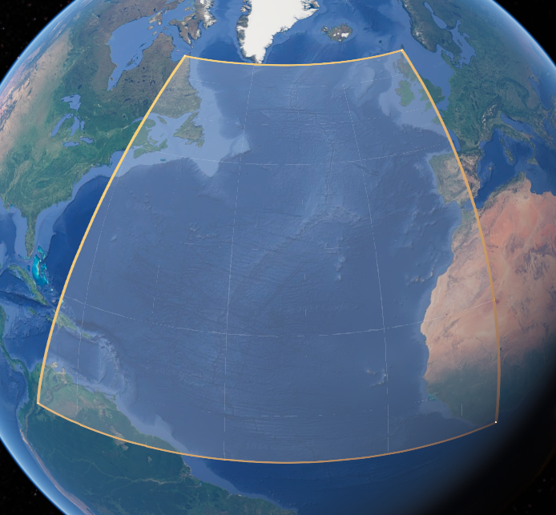
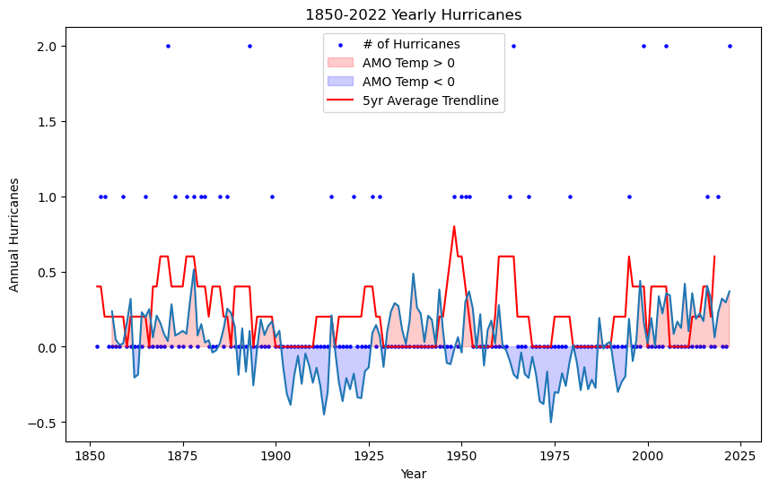
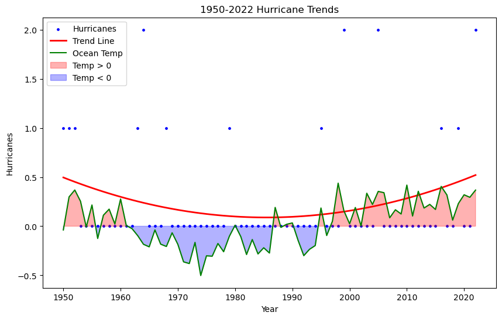
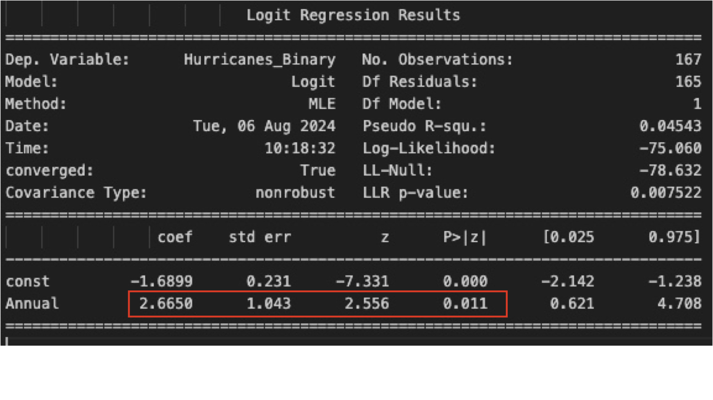
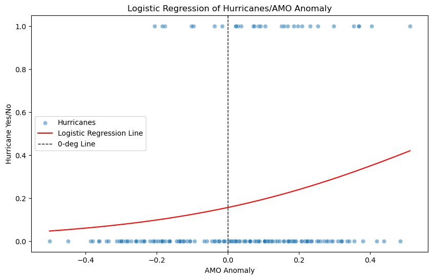
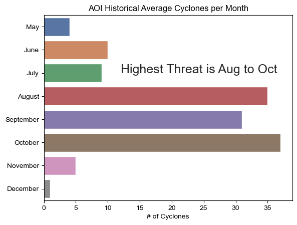
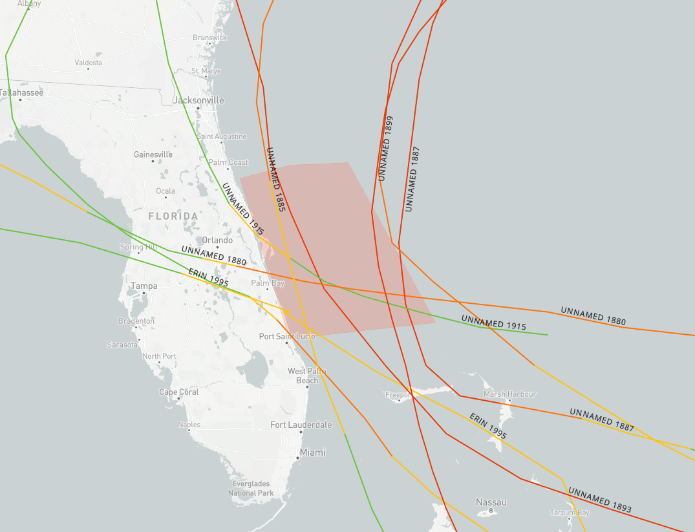
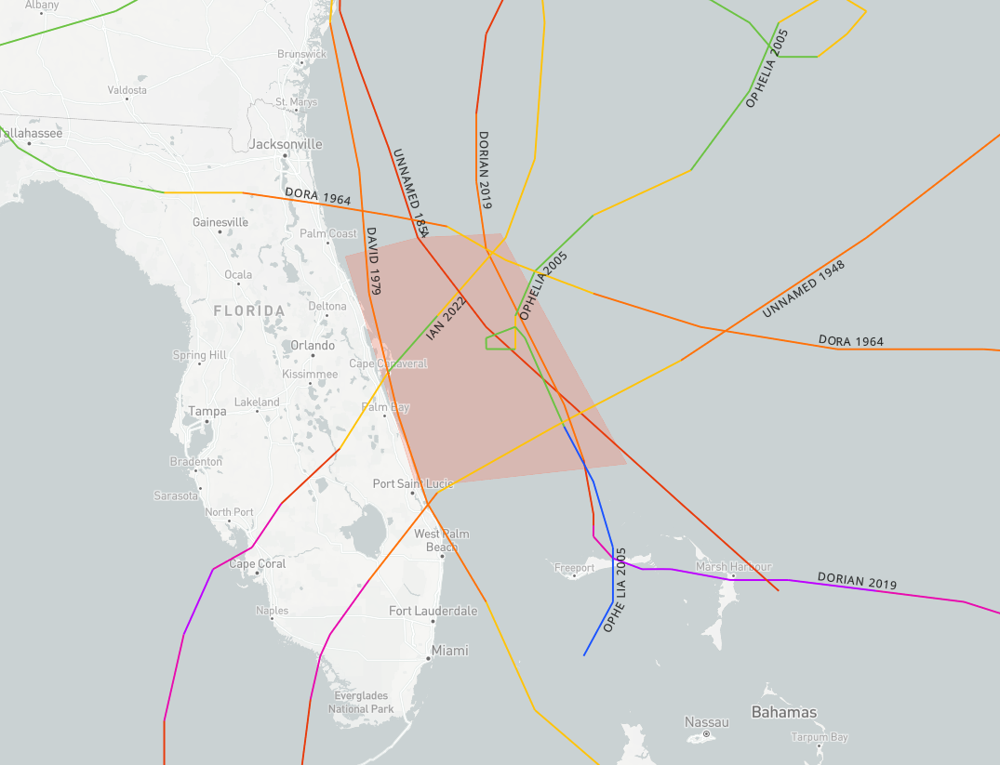
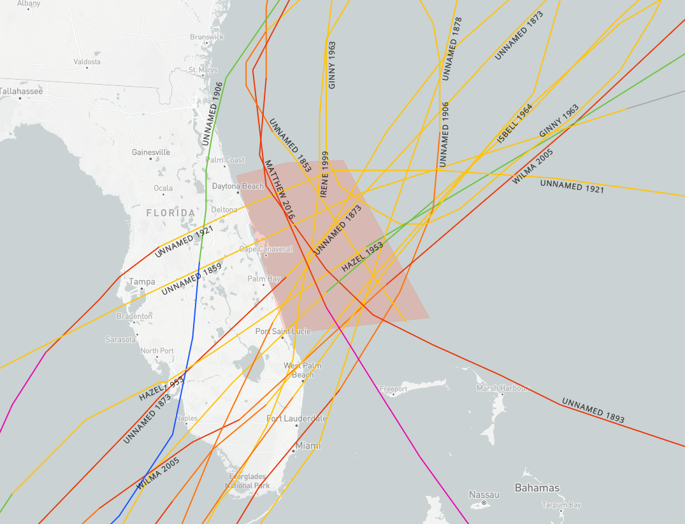

# SpaceCoast-Hurricane-Prediction

- The goal is to provide SLD 45 and Kennedy Space Center with a more precise forecast for hurricane season. Specifically, we want to know the likelihood of having a hurricane pass through our area every year.

- Tropical cyclones have an unknown number of variables to consider for forecasting. In this study I have focused on the Atlantic Multidecadal Oscillation (AMO) temperature anomalies and their effect on hurricane season for our area.

- The main goal is to provide a model prediction based on the AMO anomalies.

- Additionally, I will try to build another model that predicts likelihood of hurricanes impacting our area during the season based on sea level pressure indicies in a few locations.

- Finally, I'd like to provide a simple decision matrix for leadership when determining what actions to take when a hurricane is forecasted to impact our area.

## Hypothesis

- Alternate: When Atlantic Multidecadal Oscillation (AMO) is above OR below average, we will see an increase or decrease in Hurricanes per year.

- NULL: There is no difference in hurricane likelihood with AMO anomalies.

## Model prediction for in season hurricanes

- Model prediction is for hurricanes already developed. It will give a likelihood if hurricanes will hit our area.

- NULL hypothesis: The sea level pressure stations and AMO have no effect on hurricanes.

- Alternate hypothesis: higher AMO anomalies and lower sea level pressure increases the chance for hurricanes to impact our area.

## Data Cleaning

- References/Sources are at the end of this readme.

- The hurdat file is from NHC and contains all tropical cyclone information from the 1850s to 2022.

- The hurdat file goes through numerous functions to clean lat/long, adjust headers, and compile into a single dataframe. From that dataframe we filter it further to be for a specific lat/long, which is a large box around Cape Canaveral. You could change this to any lat/long and it would still run just fine.

- After filtering, I apply a status prioirity and then pull unique cyclones that equal a hurricane status. You could take the filtered data and do other types of analysis if you like.

- Then we pull in the AMO data and combine it with hurricanes, which let's you make a polynomial regression if you want. I recommend you do from 1950 to 2022 for this one.

- Next we filter the hurricanes to only show if they occurred 1 or 0 for each year along with the AMO numbers. This is how we build the first logistic regression model.

- The random forest model uses the sea level pressure stations, AMO, and hurricanes binary form. The sea level pressure data needed a lot of help and I used an imputter to fill data from 2005 to 2022.

## Area of Interest

### The center point is Cape Canaveral with roughly a 60mi radius

## Hurricane Analysis

- Initially we are focusing on the Atlantic Multidecadal Oscillation (AMO) temperature anomalies and their effect on hurricane prediction for the Space Coast.

- Below is a visual of the AMO region for reference.

- Below is an image showing the AMO anomalies with the trend of hurricanes since 1850.

- Below is an image showing the AMO anomalies with the trend of hurricanes since 1950.

## Hypothesis Test

- I ran a logistic regression model to compare yearly AMO anomalies and if a hurricane passed through the area. Data is from 1856 to 2022.

- Higher positive coefficients show the temperature increase is significant and the P-Value shows this IS statistically significant. Higher temperature anomalies result in an increased likelihood of hurricanes for our area.

- Below is a chart displaying the results. Notice the significant increase as we see above normal temperature anomalies.

- The second model runs on AMO and sea level pressure for 3 stations.

- Merida mean = 1013.46

- Charleston mean = 1017.85

- Nassau mean = 1015.03

## Historical Average Amount of All Cyclones per Month

- The main foucs here is to show when we need to worry.
- Our area will see the most activity from August to October.
- Coupled with thunderstorm season we can expect a higher likelihood of launch scrubs due to weather.

## Historical Hurricane Tracks in Aug, Sept, and Oct

### Charts pulled from NOAA

### August

- Cyclones predominantly coming from the south to SE

### September

- Most active month

- Start to see some cyclones coming from the west now

### October

- Now we see most cyclones coming from the Gulf of Mexico

- This is due to the Atlantic water temperatures starting to cool down. The Gulf of Mexico remains warm

## Decision Recommendations for Hurricanes

- Want to create a decision matrix.
- Hurricane track from East to South. Likely Aug-Sep
  - Greatest threat, evacuation recommended.
- Hurricane track from SSW to West. Likely Oct
  - Lower threat, evacuation not recommended.

## Streamlit

- The file app.py in src directory contains the streamlit code.

## References/Sources

- The hurdat file is at <https://www.nhc.noaa.gov/data/>

- The AMO data is at <https://psl.noaa.gov/data/timeseries/AMO/> and choose AMO unsmooth, long.

- The sea level pressure stations were a little tricky. Navigate to this site <https://www.metoffice.gov.uk/hadobs/hadslp2/> and then you will need to download the HADSLP2 data, which has a ton of sites. You want to find the ones that match the files in the data directory.

- The AMM_sst is at <https://psl.noaa.gov/data/timeseries/monthly/AMM/>.

- The TNA_sst is at <https://psl.noaa.gov/data/climateindices/list/> and you just click on TNA.

- The rh_mdr you need to use what I have. I don't remember exactly how I got it at them moment.
